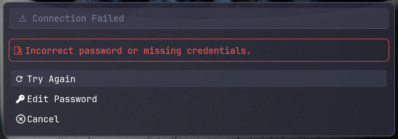
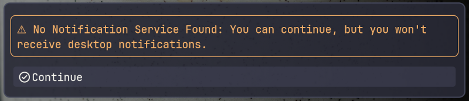
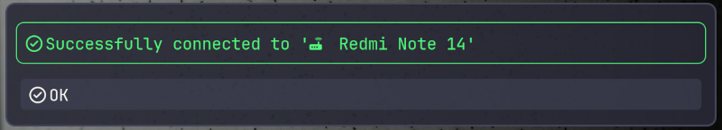
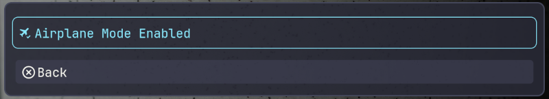

<h1 align="center">
  
  <br>
  HyprLTM-Net
</h1>

<p align="center">
  <strong>A high-performance network management interface (GUI) for Hyprland, powered by Rofi and NetworkManager.</strong>
</p>

<p align="center">
  <a href="https://github.com/hyprltm/hyprltm-net/stargazers"></a>
  <a href="https://github.com/hyprltm/hyprltm-net/commits/main"></a>
  <a href="https://github.com/hyprltm/hyprltm-net/blob/main/LICENSE"></a>
  <a href="https://github.com/hyprltm/hyprltm-net"></a>
</p>

https://github.com/user-attachments/assets/7da1d5b8-d8a1-47f4-8809-e82efc078ab2

<p align="center"><em>HyprLTM-Net Demo</em></p>


## ✨ Features

<table>
<tr>
<td width="50%">

### 📶 Wi-Fi Management
- Scan for nearby networks
- Connect to new or hidden SSIDs
- Manage saved connections & passwords

### 🔌 Wired Profiles
- Switch between Ethernet configurations
- View connection status

</td>
<td width="50%">

### 🔐 VPN Support
- **WireGuard** & **OpenVPN** integration
- Import `.conf` or `.ovpn` files directly

### ⚙️ Advanced Controls
- **Airplane Mode** toggle 
- **QR Code Sharing** for Wi-Fi 
- **Hotspot Manager** 

</td>
</tr>
</table>

### 📦 Smart Installation
- **Distro Detection**: Auto-installs dependencies (Arch, Fedora, openSUSE, NixOS)
- **Desktop Entry**: Creates launcher menu entry & icon

### 💬 Robust Feedback
`hyprltm-net` includes a complete visual feedback system ensuring you never miss a status update.
- **🎨 Universal Semantic Styling**: Red (Error), Orange (Warning), Green (Success), and Blue (Info).
- **🛑 Blocking Dialogs**: Critical errors (e.g. Wrong Password) require user action to proceed.
- **🔔 Fallback Notification System**: If no notification service (like `dunst`) is running, the script automatically falls back to Rofi dialogs.

#### Feedback Gallery
<div align="center">
  <table width="80%">
    <tr>
      <td align="center">
        <br>
        <sub><b>Error (Red)</b>: Critical failures (like a wrong password or failed connection) trigger a blocking dialog. This ensures errors are never ignored silently.</sub>
      </td>
    </tr>
  </table>
  <br>
  <table width="80%">
    <tr>
      <td align="center">
        <br>
        <sub><b>Warning (Orange)</b>: Alerts the user to important states, such as "No Notification Service found," suggesting a fallback to Rofi dialogs.</sub>
      </td>
    </tr>
  </table>
  <br>
  <table width="80%">
    <tr>
      <td align="center">
        <br>
        <sub><b>Success (Green)</b>: Immediate visual confirmation when a connection is successfully established.</sub>
      </td>
    </tr>
  </table>
  <br>
  <table width="80%">
    <tr>
      <td align="center">
        <br>
        <sub><b>Info (Blue)</b>: Contextual information, such as confirming that "Airplane Mode" has been enabled.</sub>
      </td>
    </tr>
  </table>
</div>


## 🌳 Menu Structure

```
Main Menu
├── Wi-Fi
│   ├── Status (Current Connection) -> View Details (IP, Signal, Mac...)
│   ├── Toggle (Enable / Disable)
│   ├── Available Networks (SSID List)
│   │   ├── [New Secure Network]
│   │   │   └── Enter Password
│   │   │       └── Password Actions (Show/Hide/Edit/Confirm)
│   │   └── [Saved Network]
│   │       ├── Autoconnect (Toggle)
│   │       ├── Connect / Disconnect Now
│   │       ├── IPv4 Configuration
│   │       ├── IPv6 Configuration
│   │       ├── Forget Connection
│   │       ├── Rename Connection
│   │       ├── Edit Password
│   │       └── Share via QR Code
│   ├── Hotspot Manager
│   │   ├── Create New Hotspot
│   │   └── Manage Saved Hotspots
│   │       └── [Hotspot Profile] -> (Toggle, Edit Password, Rename, Delete)
│   ├── Known Connections (Saved Profiles)
│   │   └── [Saved Wi-Fi Profile]
│   │       ├── Autoconnect (Toggle)
│   │       ├── Connect / Disconnect Now
│   │       ├── IPv4 Configuration
│   │       ├── IPv6 Configuration
│   │       ├── Forget Connection
│   │       ├── Rename Connection
│   │       ├── Edit Password
│   │       └── Share via QR Code
│   └── Connect to a hidden network
├── Wired
│   ├── [Available Interface] -> Connect
│   └── [Saved Profile] -> (Same options as Wi-Fi)
├── VPN
│   ├── [VPN Profile]
│   │   ├── Autoconnect (Toggle)
│   │   ├── Connect / Disconnect
│   │   ├── IPv4 / IPv6 Configuration
│   │   ├── Forget Connection
│   │   ├── Rename Connection
│   │   └── Edit Password (if applicable)
│   └── Import Configuration
├── Saved Connections
│   └── [List of All Profiles]
│       ├── Autoconnect (Toggle)
│       ├── Connect / Disconnect Now
│       ├── IPv4 Configuration
│       ├── IPv6 Configuration
│       ├── Forget Connection
│       ├── Rename Connection
│       ├── Edit Password
│       └── Share via QR Code
├── Status
│   ├── Active Connection Details (Popup)
│   └── All Device Status (List)
└── Airplane Mode (Toggle)
```

## 🛠️ Prerequisites

| Package | Purpose |
| :--- | :--- |
| `networkmanager` | Backend connection management (`nmcli`) |
| `rofi-wayland` | The graphical menu engine |
| `qrencode` | Generating Wi-Fi QR codes |
| `dnsmasq` | Required for Hotspot creation (DHCP) |
| `Nerd Fonts` | Required for icons (e.g., *JetBrains Mono Nerd Font*) |
| `libnotify` | **(Optional)** For desktop notifications via `notify-send` |


## 🚀 Installation

### 1. One-Line Installation
```bash
bash <(curl -s https://raw.githubusercontent.com/hyprltm/hyprltm-net/main/setup.sh)
```
The script will auto-detect your distribution, install dependencies, and set up the menu.

<details>
<summary><strong>Manual Installation</strong></summary>

If you prefer to install manually:
```bash
mkdir -p ~/.local/bin && cp hyprltm-net.sh ~/.local/bin/hyprltm-net && chmod +x ~/.local/bin/hyprltm-net
mkdir -p ~/.config/rofi/themes/ && cp *.rasi ~/.config/rofi/themes/
```

**Keybind:** Add to `~/.config/hypr/hyprland.conf`:
```ini
bind = SUPER, N, exec, hyprltm-net
```

**Waybar:** Add to your `network` module in `~/.config/waybar/config.jsonc`:
```json
"on-click": "hyprltm-net"
```
</details>


## 🎨 Theming

HyprLTM-Net uses the **LTMNight** color palette. Customize appearance by editing `~/.config/rofi/themes/ltmnight.rasi`.

| Variable | Description | Default | Usage |
| :--- | :--- | :--- | :--- |
| `@ltmnight0` | Background | `#282a36` | Menu Background |
| `@ltmnight2` | Foreground | `#f8f8f2` | Main Text |
| `@ltmnight9` | Primary Accent | `#bd93f9` | List Selection |
| `@ltmnight4` | **Error** | `#ff5555` | 🟥 Error Dialogs |
| `@ltmnight5` | **Warning** | `#ffb86c` | 🟧 Warnings / Alerts |
| `@ltmnight7` | **Success** | `#50fa7b` | 🟩 Success Messages |
| `@ltmnight8` | **Info** | `#8be9fd` | 🟦 Info Dialogs |
| `@ltmnight3` | Comments | `#6272a4` | Borders / Outlines |


## ❤️ Support the Project

If you find this tool helpful, there are many ways to support the project:

### 💰 Financial Support
If you'd like to support the development financially:

<a href="https://www.buymeacoffee.com/linuxtechmore"></a>
<a href="https://github.com/sponsors/sniper1720"></a>

### 🤝 Contribute & Support
Financial contributions are not the only way to help! Here are other options:
- **⭐ Star the Repository**: It helps more people find the project!
- **🩹 Report Bugs**: Found an issue? Open a ticket on GitHub.
- **💡 Suggest Features**: Have a cool idea? Let me know!
- **📢 Share**: Tell your friends!

Every bit of support helps keep the project alive and ensures I can spend more time developing open source tools for the Linux community!


## 📄 License

**Created by [Djalel Oukid (sniper1720)](https://github.com/sniper1720)** and distributed under the **GPL-3.0 License**.

*Check out more Linux & Open Source content on my [website!](https://www.linuxtechmore.com)*
